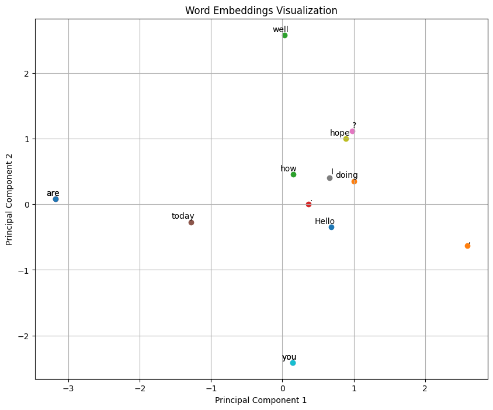

# Extra-Chapter：text-data-processing

本补充章节旨在对大模型数据处理做一个简单的梳理与具体的代码实现，帮助大家对于大模型的数据处理有一个更加清晰的认识。

## 1.理解词嵌入

在深度神经网络模型中，由于文本是分类数据，模型无法直接处理原始文本，因此需要将词语表示为连续值向量传输给模型。这一处理过程我们称之为词嵌入，其本质是将**离散对象**（如词语）映射到**连续向量**空间中的点，目的是将非数值数据转换为神经网络可处理的格式。

通过将每个词映射为高维空间中的点（如“猫”=[0.2, -1.7, ...]），使语义相似的词（如“猫”和“狗”）向量距离更近，而无关词（如“猫”和“汽车”）距离更远。这种向量化表示既保留词语关系（“国王-男性+女性≈女王”），又能作为神经网络的输入，是大模型理解语言的基础。

我们可以看一下下面的代码示例


```python
import torch
import torch.nn as nn
import torch.nn.functional as F
from torch.utils.data import Dataset, DataLoader
import numpy as np
import matplotlib.pyplot as plt
from sklearn.decomposition import PCA
import re

# 示例文本（可自行修改并且测试）
text = "Hello, how are you today? I hope you are doing well."

# 简单分词函数
def tokenize(text):
    # 按非字母数字字符分割文本，并保留分隔符
    tokens = re.findall(r'\w+|[^\w\s]', text)
    return tokens
# 构建词汇表
def build_vocab(tokens):
    unique_tokens = sorted(set(tokens))
    vocab = {token: i for i, token in enumerate(unique_tokens)}
    vocab_size = len(vocab)
    return vocab, vocab_size
# 文本编码
def encode_text(tokens, vocab):
    return [vocab.get(token, vocab['<unk>']) for token in tokens]

# 创建词嵌入模型
class WordEmbeddingModel(nn.Module):
    def __init__(self, vocab_size, embedding_dim):
        super(WordEmbeddingModel, self).__init__()
        self.embedding = nn.Embedding(vocab_size, embedding_dim)
        
    def forward(self, inputs):
        return self.embedding(inputs)

# 可视化词向量
def visualize_embeddings(embeddings, token_ids, vocab):
    reverse_vocab = {i: token for token, i in vocab.items()}
    pca = PCA(n_components=2)
    embeddings_2d = pca.fit_transform(embeddings.detach().numpy())
    # 绘制散点图
    plt.figure(figsize=(10, 8))
    for i, token_id in enumerate(token_ids):
        plt.scatter(embeddings_2d[i, 0], embeddings_2d[i, 1], marker='o')
        plt.annotate(reverse_vocab[token_id], 
                     (embeddings_2d[i, 0], embeddings_2d[i, 1]),
                     xytext=(5, 2), 
                     textcoords='offset points',
                     ha='right', 
                     va='bottom')
    plt.title('Word Embeddings Visualization')
    plt.xlabel('Principal Component 1')
    plt.ylabel('Principal Component 2')
    plt.grid(True)
    plt.savefig('word_embeddings.png')
    plt.show()

def main():
    tokens = tokenize(text)
    print(f"Tokens: {tokens}")
    tokens_with_special = tokens + ['<pad>', '<unk>']
    
    # 构建词汇表
    vocab, vocab_size = build_vocab(tokens_with_special)
    print(f"Vocabulary size: {vocab_size}")
    print(f"Vocabulary: {vocab}")
    
    # 编码文本
    encoded_text = encode_text(tokens, vocab)
    print(f"Encoded text: {encoded_text}")
    input_tensor = torch.tensor(encoded_text, dtype=torch.long)
    
    # 初始化模型
    embedding_dim = 10  # 词向量维度，即提到的词空间
    model = WordEmbeddingModel(vocab_size, embedding_dim)
    # 获取词向量
    embeddings = model(input_tensor)
    print(f"Embeddings shape: {embeddings.shape}")  # 这里应该是 [序列长度, 嵌入维度]
    
    print(f"Word vector for '{tokens[0]}': {embeddings[0].detach().numpy()}")
    print(f"Word vector for '{tokens[1]}': {embeddings[1].detach().numpy()}")
    # 可视化词向量（仅用于低维演示，实际应用中词向量维度通常较高）
    if embedding_dim >= 2:
        visualize_embeddings(embeddings, encoded_text, vocab)
    
    # 计算词之间的相似度
    print("\n词相似度分析:")
    for i, token_i in enumerate(tokens[:5]):  # 只分析前5个词
        for j, token_j in enumerate(tokens[:5]):
            if i != j:
                # 计算余弦相似度
                sim = F.cosine_similarity(embeddings[i].unsqueeze(0), 
                                         embeddings[j].unsqueeze(0))
                print(f" '{token_i}' 和 '{token_j}' 的相似度: {sim.item():.4f}")

if __name__ == "__main__":
    main()    
```

    Tokens: ['Hello', ',', 'how', 'are', 'you', 'today', '?', 'I', 'hope', 'you', 'are', 'doing', 'well', '.']
    Vocabulary size: 14
    Vocabulary: {',': 0, '.': 1, '<pad>': 2, '<unk>': 3, '?': 4, 'Hello': 5, 'I': 6, 'are': 7, 'doing': 8, 'hope': 9, 'how': 10, 'today': 11, 'well': 12, 'you': 13}
    Encoded text: [5, 0, 10, 7, 13, 11, 4, 6, 9, 13, 7, 8, 12, 1]
    Embeddings shape: torch.Size([14, 10])
    Word vector for 'Hello': [-0.16787808 -0.46388683 -0.4728546   0.59449345 -0.23820949  0.34212282
      0.6591729  -0.10877569  0.60686487 -1.771871  ]
    Word vector for ',': [ 0.19194137 -1.2824519   1.1420391  -0.8361696  -0.578317    0.1025617
      1.2452478  -0.08552601  0.9869009  -0.04940421]
    


    

    


    
    词相似度分析:
     'Hello' 和 ',' 的相似度: 0.2132
     'Hello' 和 'how' 的相似度: -0.0277
     'Hello' 和 'are' 的相似度: 0.1024
     'Hello' 和 'you' 的相似度: 0.1597
     ',' 和 'Hello' 的相似度: 0.2132
     ',' 和 'how' 的相似度: -0.0801
     ',' 和 'are' 的相似度: -0.6096
     ',' 和 'you' 的相似度: 0.2355
     'how' 和 'Hello' 的相似度: -0.0277
     'how' 和 ',' 的相似度: -0.0801
     'how' 和 'are' 的相似度: 0.1170
     'how' 和 'you' 的相似度: -0.0412
     'are' 和 'Hello' 的相似度: 0.1024
     'are' 和 ',' 的相似度: -0.6096
     'are' 和 'how' 的相似度: 0.1170
     'are' 和 'you' 的相似度: 0.2203
     'you' 和 'Hello' 的相似度: 0.1597
     'you' 和 ',' 的相似度: 0.2355
     'you' 和 'how' 的相似度: -0.0412
     'you' 和 'are' 的相似度: 0.2203
    

这下我们就能够很清楚的在散点图中看到不同词语之间的距离。

## 2.分词

分词是将输入文本拆分为单个标记（可以是单词、标点符号等）的过程，举个例子，我们可以把句子“Hello, world!”拆成一小块一小块的形式，如```["Hello", ",", "world", "!"]```，使计算机能够逐块处理语言，进一步转换为模型可处理的数值形式。

我们可以从简单的分词方法入手，例如使用 Python 的正则表达式（re 库）按空白字符拆分文本，但这种方法可能导致标点符号与单词粘连（如 “Hello,” 中的逗号未分离）。

为此，我们可以在代码当中修改正则表达式，在空白字符、逗号、句号等处进行拆分，使单词与标点符号成为独立列表项。

同时，在处理的过程中需注意保留空白字符或移除冗余空白，例如处理 Python 代码时需保留缩进，而普通文本可移除。
值得注意的是：通常不将文本转为小写，因为大小写有助于模型区分专有名词、理解句子结构。
实现代码如下：


```python
import re
import tiktoken
from collections import defaultdict

class SimpleTokenizer:
    """简单分词器实现"""
    def __init__(self, text=None):
        self.vocab = {}
        self.reverse_vocab = {}
        self.vocab_size = 0
        self.special_tokens = {
            '<pad>': 0,
            '<unk>': 1,
            '<bos>': 2,
            '<eos>': 3
        }
        if text:
            self.build_vocab(text)

    def tokenize(self, text):
        """将文本分割为标记列表"""
        # 保留空白字符的分词
        tokens = re.findall(r'\S+|\s+', text)
        return tokens
    
    def build_vocab(self, text):
        """构建词汇表"""
        self.vocab = self.special_tokens.copy()
        self.vocab_size = len(self.special_tokens)
        tokens = self.tokenize(text)
        token_counts = defaultdict(int)
        for token in tokens:
            token_counts[token] += 1
        sorted_tokens = sorted(token_counts.items(), key=lambda x: (-x[1], x[0]))
        for token, _ in sorted_tokens:
            if token not in self.vocab:
                self.vocab[token] = self.vocab_size
                self.vocab_size += 1
        self.reverse_vocab = {v: k for k, v in self.vocab.items()}
    
    def encode(self, text):
        """将文本转换为标记ID序列"""
        tokens = self.tokenize(text)
        return [self.vocab.get(token, self.vocab['<unk>']) for token in tokens]
    
    def decode(self, token_ids):
        """将标记ID序列转换回文本"""
        tokens = []
        for token_id in token_ids:
            if token_id in self.reverse_vocab:
                tokens.append(self.reverse_vocab[token_id])
            else:
                tokens.append('<unk>')
        text = ''
        prev_token = None
        for token in tokens:
            if prev_token and prev_token.isspace():
                text += token
            else:
                text = text.rstrip() + token
            prev_token = token
            
        return text


class BPETokenizer:
    """基于字节对编码(BPE)的分词器"""
    def __init__(self, model_name="gpt2"):
        """
        初始化BPE分词器
        model_name: 模型名称，如"gpt2"或"cl100k_base"(OpenAI的text-embedding-ada-002使用)
        """
        self.encoder = tiktoken.get_encoding(model_name)
        self.vocab_size = self.encoder.n_vocab
    
    def tokenize(self, text):
        """将文本转换为BPE标记列表"""
        token_ids = self.encoder.encode(text)
        tokens = [self.encoder.decode_single_token_bytes(token_id) for token_id in token_ids]
        return tokens
    
    def encode(self, text):
        """将文本转换为BPE标记ID序列"""
        return self.encoder.encode(text)
    
    def decode(self, token_ids):
        """将BPE标记ID序列转换回文本"""
        return self.encoder.decode(token_ids)

if __name__ == "__main__":
    sample_text = "Hello, how are you today? I hope you are doing well."
    print("=== 简单分词器 ===")
    simple_tokenizer = SimpleTokenizer(sample_text)
    tokens = simple_tokenizer.tokenize(sample_text)
    print(f"分词结果: {tokens}")
    encoded = simple_tokenizer.encode(sample_text)
    print(f"编码结果: {encoded}")
    decoded = simple_tokenizer.decode(encoded)
    print(f"解码结果: {decoded}")
    print(f"词汇表大小: {simple_tokenizer.vocab_size}")
    print("\n=== BPE分词器 (GPT-2) ===")
    bpe_tokenizer = BPETokenizer("gpt2")
    bpe_tokens = bpe_tokenizer.tokenize(sample_text)
    print(f"BPE分词结果: {bpe_tokens}")
    bpe_encoded = bpe_tokenizer.encode(sample_text)
    print(f"BPE编码结果: {bpe_encoded}")
    bpe_decoded = bpe_tokenizer.decode(bpe_encoded)
    print(f"BPE解码结果: {bpe_decoded}")
    print(f"BPE词汇表大小: {bpe_tokenizer.vocab_size}")    
```

    === 简单分词器 ===
    分词结果: ['Hello,', ' ', 'how', ' ', 'are', ' ', 'you', ' ', 'today?', ' ', 'I', ' ', 'hope', ' ', 'you', ' ', 'are', ' ', 'doing', ' ', 'well.']
    编码结果: [7, 4, 11, 4, 5, 4, 6, 4, 12, 4, 8, 4, 10, 4, 6, 4, 5, 4, 9, 4, 13]
    解码结果: Hello, how are you today? I hope you are doing well.
    词汇表大小: 14
    
    === BPE分词器 (GPT-2) ===
    BPE分词结果: [b'Hello', b',', b' how', b' are', b' you', b' today', b'?', b' I', b' hope', b' you', b' are', b' doing', b' well', b'.']
    BPE编码结果: [15496, 11, 703, 389, 345, 1909, 30, 314, 2911, 345, 389, 1804, 880, 13]
    BPE解码结果: Hello, how are you today? I hope you are doing well.
    BPE词汇表大小: 50257
    

## 3.将标记转换为标记ID

将标记转换为标记 ID 是连接文本与数值向量的中间步骤，其核心是构建 “词汇表”—— 一个从唯一标记到唯一整数的映射（如图 2.6 所示）。词汇表的构建过程是：从分词后的文本中提取所有唯一标记，按字母顺序排序后，为每个标记分配一个整数 ID。例如，《判决》分词后得到 1130 个唯一标记，词汇表便会将这些标记分别映射到 0 至 1129 的整数。

有了词汇表，我们就能通过 “编码” 将文本转换为标记 ID（例如 “Hello” 对应某个整数），也能通过 “解码” 将标记 ID 转回文本。这一过程可通过分词器类实现，例如 SimpleTokenizerV1 包含 encode 和 decode 方法：encode 先对文本分词，再用词汇表映射为 ID；decode 则将 ID 通过反向映射转回文本，并处理标点符号前的空格问题。

但需注意，若文本中出现词汇表外的标记（如 “Hello” 未出现在《判决》中），编码时会报错，这说明训练集的规模和多样性对扩展词汇表至关重要，也引出了后续处理未知词汇的需求。

整体实现代码如下：


```python
import re
from collections import Counter
from typing import List, Dict, Tuple, Optional, Set
class Tokenizer:
    """将文本转换为标记并映射到ID的分词器"""
    
    def __init__(self, special_tokens: Optional[Dict[str, int]] = None):
        """
        初始化分词器
        
        Args:
            special_tokens: 特殊标记及其ID的字典，默认为None
        """
        self.vocab: Dict[str, int] = {}  # 词汇表: 标记 -> ID
        self.reverse_vocab: Dict[int, str] = {}  # 反向词汇表: ID -> 标记
        self.special_tokens = special_tokens or {
            "<pad>": 0,  # 填充标记
            "<unk>": 1,  # 未知标记
            "<bos>": 2,  # 序列开始标记
            "<eos>": 3   # 序列结束标记
        }
        self.vocab_size: int = len(self.special_tokens)  # 词汇表大小
        # 初始化词汇表，添加特殊标记
        for token, idx in self.special_tokens.items():
            self.vocab[token] = idx
            self.reverse_vocab[idx] = token
    
    def build_vocab(self, texts: List[str], min_freq: int = 1) -> None:
        """
        从文本构建词汇表
        
        Args:
            texts: 文本列表
            min_freq: 最小词频，低于此频率的词将被忽略
        """
        # 统计词频
        token_counts = Counter()
        for text in texts:
            tokens = self.tokenize(text)
            token_counts.update(tokens)
        # 按频率排序，频率相同则按字母顺序
        sorted_tokens = sorted(
            [(token, count) for token, count in token_counts.items() if count >= min_freq],
            key=lambda x: (-x[1], x[0])  
        )
        # 为每个标记分配ID
        for token, _ in sorted_tokens:
            if token not in self.vocab:
                self.vocab[token] = self.vocab_size
                self.reverse_vocab[self.vocab_size] = token
                self.vocab_size += 1
    
    def tokenize(self, text: str) -> List[str]:
        """
        将文本分割为标记列表
        
        Args:
            text: 输入文本
            
        Returns:
            标记列表
        """
        tokens = re.findall(r'\w+|[^\w\s]|\s+', text)
        return tokens
    
    def encode(self, text: str, add_special_tokens: bool = False) -> List[int]:
        """
        将文本转换为标记ID列表
        
        Args:
            text: 输入文本
            add_special_tokens: 是否添加特殊标记
            
        Returns:
            标记ID列表
        """
        tokens = self.tokenize(text)
        encoded = [self.vocab.get(token, self.vocab["<unk>"]) for token in tokens]
        
        if add_special_tokens:
            encoded = [self.vocab["<bos>"]] + encoded + [self.vocab["<eos>"]]
            
        return encoded
    
    def decode(self, ids: List[int], remove_special_tokens: bool = False) -> str:
        """
        将标记ID列表转换回文本
        Args:
            ids: 标记ID列表
            remove_special_tokens: 是否移除特殊标记
        Returns:
            文本
        """
        tokens = []
        for idx in ids:
            if idx in self.reverse_vocab:
                token = self.reverse_vocab[idx]
                if remove_special_tokens and token in self.special_tokens:
                    continue
                tokens.append(token)
            else:
                tokens.append("<unk>")
        text = ''.join(tokens)
        return re.sub(r'\s+', ' ', text).strip()

def test_tokenizer():
    """测试Tokenizer类的功能"""
    print("===== 测试 Tokenizer =====")
    texts = [
        "Hello, how are you today?",
        "I hope you are doing well.",
        "This is a test of the tokenizer."
    ]

    tokenizer = Tokenizer()
    tokenizer.build_vocab(texts)
    print(f"词汇表大小: {tokenizer.vocab_size}")
    print(f"前10个词汇项: {list(tokenizer.vocab.items())[:10]}")
    sample_text = "Hello, this is a test!"
    tokens = tokenizer.tokenize(sample_text)
    print(f"\n分词结果: {tokens}")
    encoded = tokenizer.encode(sample_text)
    print(f"编码结果: {encoded}")
    encoded_with_special = tokenizer.encode(sample_text, add_special_tokens=True)
    print(f"带特殊标记的编码结果: {encoded_with_special}")
    decoded = tokenizer.decode(encoded)
    print(f"解码结果: {decoded}")
    decoded_with_special = tokenizer.decode(encoded_with_special, remove_special_tokens=True)
    print(f"移除特殊标记的解码结果: {decoded_with_special}")
    unknown_text = "This is a unicorn 🦄 test."
    encoded_unknown = tokenizer.encode(unknown_text)
    decoded_unknown = tokenizer.decode(encoded_unknown)
    print(f"\n包含未知词汇的文本: {unknown_text}")
    print(f"编码结果: {encoded_unknown}")
    print(f"解码结果: {decoded_unknown}")

if __name__ == "__main__":
    test_tokenizer()    
```

    ===== 测试 Tokenizer =====
    词汇表大小: 24
    前10个词汇项: [('<pad>', 0), ('<unk>', 1), ('<bos>', 2), ('<eos>', 3), (' ', 4), ('.', 5), ('are', 6), ('you', 7), (',', 8), ('?', 9)]
    
    分词结果: ['Hello', ',', ' ', 'this', ' ', 'is', ' ', 'a', ' ', 'test', '!']
    编码结果: [10, 8, 4, 1, 4, 17, 4, 13, 4, 19, 1]
    带特殊标记的编码结果: [2, 10, 8, 4, 1, 4, 17, 4, 13, 4, 19, 1, 3]
    解码结果: Hello, <unk> is a test<unk>
    移除特殊标记的解码结果: Hello, is a test
    
    包含未知词汇的文本: This is a unicorn 🦄 test.
    编码结果: [12, 4, 17, 4, 13, 4, 1, 4, 1, 4, 19, 5]
    解码结果: This is a <unk> <unk> test.
    

## 4.添加特殊上下文标记

为解决未知词汇问题并增强模型对上下文的理解，需引入特殊标记。常见的特殊标记包括：<|unk|>（表示未知词汇）、（分隔不同文本来源）、[BOS]（序列开始）、[EOS]（序列结束）、[PAD]（填充短文本至统一长度）等。

例如，修改词汇表加入 <|unk|> 和后，分词器（如 SimpleTokenizerV2）在遇到未知词时会自动替换为 <|unk|>，并在不同文本间插入作为分隔。这一调整使模型能处理未见过的词汇，并区分独立文本来源。需注意，GPT 模型通常仅使用作为分隔符和填充符，而不依赖 <|unk|>，因为其采用的字节对编码（BPE）分词器能通过子词分解处理未知词，这也是后续将介绍的更高效方法。


```python
import re
from typing import List, Dict, Optional, Set

class Tokenizer:
    """带有特殊上下文标记的分词器"""
    def __init__(self, special_tokens: Optional[Dict[str, int]] = None):
        """
        初始化分词器
        
        Args:
            special_tokens: 特殊标记及其ID的字典，默认为None
        """
        # 设置默认特殊标记
        self.default_special_tokens = {
            "<pad>": 0,  # 填充标记
            "<unk>": 1,  # 未知标记
            "<bos>": 2,  # 序列开始标记
            "<eos>": 3,  # 序列结束标记
            "<sep>": 4,  # 分隔标记
            "<cls>": 5,  # 分类标记
        }
        # 合并用户提供的特殊标记
        self.special_tokens = {**self.default_special_tokens, **(special_tokens or {})}
        # 初始化词汇表
        self.vocab: Dict[str, int] = {}
        self.reverse_vocab: Dict[int, str] = {}
        self.vocab_size: int = len(self.special_tokens)
        # 添加特殊标记到词汇表
        for token, idx in self.special_tokens.items():
            self.vocab[token] = idx
            self.reverse_vocab[idx] = token
    
    def build_vocab(self, texts: List[str], min_freq: int = 1) -> None:
        """
        从文本构建词汇表
        
        Args:
            texts: 文本列表
            min_freq: 最小词频，低于此频率的词将被忽略
        """
        # 统计词频
        token_counts = {}
        for text in texts:
            tokens = self.tokenize(text)
            for token in tokens:
                token_counts[token] = token_counts.get(token, 0) + 1
        
        # 按频率排序，频率相同则按字母顺序
        sorted_tokens = sorted(
            [(token, count) for token, count in token_counts.items() if count >= min_freq],
            key=lambda x: (-x[1], x[0])  # 按频率降序，字母升序
        )
        
        # 为每个标记分配ID
        for token, _ in sorted_tokens:
            if token not in self.vocab:
                self.vocab[token] = self.vocab_size
                self.reverse_vocab[self.vocab_size] = token
                self.vocab_size += 1
    
    def tokenize(self, text: str) -> List[str]:
        """
        将文本分割为标记列表
        
        Args:
            text: 输入文本
            
        Returns:
            标记列表
        """
        # 简单的分词：按非字母数字字符分割，保留空格和标点符号
        tokens = re.findall(r'\w+|[^\w\s]|\s+', text)
        return tokens
    
    def encode(self, text: str, add_special_tokens: bool = False) -> List[int]:
        """
        将文本转换为标记ID列表
        
        Args:
            text: 输入文本
            add_special_tokens: 是否添加特殊标记
            
        Returns:
            标记ID列表
        """
        tokens = self.tokenize(text)
        encoded = [self.vocab.get(token, self.vocab["<unk>"]) for token in tokens]
        if add_special_tokens:
            encoded = [self.vocab["<bos>"]] + encoded + [self.vocab["<eos>"]]
        return encoded
    def decode(self, ids: List[int], remove_special_tokens: bool = False) -> str:
        """
        将标记ID列表转换回文本
        Args:
            ids: 标记ID列表
            remove_special_tokens: 是否移除特殊标记
        Returns:
            文本
        """
        tokens = []
        for idx in ids:
            if idx in self.reverse_vocab:
                token = self.reverse_vocab[idx]
                if remove_special_tokens and token in self.special_tokens:
                    continue
                tokens.append(token)
            else:
                tokens.append("<unk>")
        text = ''.join(tokens)
        return re.sub(r'\s+', ' ', text).strip()
    
    def add_special_token(self, token: str) -> int:
        """
        添加新的特殊标记
        Args:
            token: 特殊标记字符串
        Returns:
            新标记的ID
        """
        if token in self.vocab:
            return self.vocab[token]
        new_id = self.vocab_size
        self.vocab[token] = new_id
        self.reverse_vocab[new_id] = token
        self.vocab_size += 1
        return new_id
    
def test_special_tokens():
    """测试特殊标记的功能"""
    print("===== 测试特殊标记 =====")
    texts = [
        "Hello, how are you today?",
        "I hope you are doing well.",
        "This is a test of the tokenizer."
    ]
    tokenizer = Tokenizer()
    tokenizer.build_vocab(texts)
    sample_text = "Hello, this is a test!"
    encoded = tokenizer.encode(sample_text, add_special_tokens=True)
    decoded = tokenizer.decode(encoded, remove_special_tokens=True)
    
    print(f"原始文本: {sample_text}")
    print(f"编码结果: {encoded}")
    print(f"解码结果: {decoded}")
    print("\n--- 测试特殊标记 ---")
    print(f"特殊标记: {tokenizer.special_tokens}")
    # 测试<bos>和<eos>
    encoded_with_bos_eos = tokenizer.encode(sample_text, add_special_tokens=True)
    print(f"带<bos>和<eos>的编码: {encoded_with_bos_eos}")
    # 测试<SEP>标记 - 连接两个句子
    print("\n--- 测试<SEP>标记 ---")
    sentence1 = "What is your name?"
    sentence2 = "My name is Doubao."
    encoded1 = tokenizer.encode(sentence1)
    encoded2 = tokenizer.encode(sentence2)
    # 添加<SEP>标记
    encoded_combined = [tokenizer.vocab["<bos>"]] + \
                       encoded1 + \
                       [tokenizer.vocab["<sep>"]] + \
                       encoded2 + \
                       [tokenizer.vocab["<eos>"]]
    decoded_combined = tokenizer.decode(encoded_combined, remove_special_tokens=True)
    print(f"句子1: {sentence1}")
    print(f"句子2: {sentence2}")
    print(f"合并后的编码: {encoded_combined}")
    print(f"合并后的解码: {decoded_combined}")
    # 测试添加新的特殊标记
    print("\n--- 测试添加新的特殊标记 ---")
    new_token = "<mask>"
    new_token_id = tokenizer.add_special_token(new_token)
    print(f"添加新特殊标记: {new_token} (ID: {new_token_id})")
    
    # 测试使用新的特殊标记
    masked_text = "This is a <mask> sentence."
    encoded_masked = tokenizer.encode(masked_text, add_special_tokens=True)
    decoded_masked = tokenizer.decode(encoded_masked, remove_special_tokens=False)
    
    print(f"带<mask>的文本: {masked_text}")
    print(f"编码结果: {encoded_masked}")
    print(f"解码结果: {decoded_masked}")


if __name__ == "__main__":
    test_special_tokens()    
```

    ===== 测试特殊标记 =====
    原始文本: Hello, this is a test!
    编码结果: [2, 12, 10, 6, 1, 6, 19, 6, 15, 6, 21, 1, 3]
    解码结果: Hello, is a test
    
    --- 测试特殊标记 ---
    特殊标记: {'<pad>': 0, '<unk>': 1, '<bos>': 2, '<eos>': 3, '<sep>': 4, '<cls>': 5}
    带<bos>和<eos>的编码: [2, 12, 10, 6, 1, 6, 19, 6, 15, 6, 21, 1, 3]
    
    --- 测试<SEP>标记 ---
    句子1: What is your name?
    句子2: My name is Doubao.
    合并后的编码: [2, 1, 6, 19, 6, 1, 6, 1, 11, 4, 1, 6, 1, 6, 19, 6, 1, 7, 3]
    合并后的解码: is ? is .
    
    --- 测试添加新的特殊标记 ---
    添加新特殊标记: <mask> (ID: 26)
    带<mask>的文本: This is a <mask> sentence.
    编码结果: [2, 14, 6, 19, 6, 15, 6, 1, 1, 1, 6, 1, 7, 3]
    解码结果: <bos>This is a <unk><unk><unk> <unk>.<eos>
    

## 5.字节对编码

字节对编码（BPE）是一种高级分词方法，被 GPT-2、GPT-3 等主流 LLMs 采用，其核心优势是能处理未知词汇 —— 将未见过的单词分解为子词单元（如图 2.11 所示）。例如，“someunknownPlace” 可拆分为已知的子词标记，无需依赖 <|unk|>。

BPE 的实现可借助 tiktoken 库（OpenAI 开源），其基于 Rust 实现，高效且兼容 GPT 模型的分词逻辑。使用时，先通过 tiktoken.get_encoding ("gpt2") 实例化分词器，再用 encode 方法将文本转换为标记 ID，decode 方法则可还原文本。例如，“Hello, do you like tea?” 经 BPE 编码后，会生成一系列整数 ID，解码后能准确还原原始文本，即使包含 “someunknownPlace” 这类未知词，也能通过子词拆分正确处理。

BPE 的词汇表规模固定（如 GPT-2 为 50257），通过迭代合并高频字符或子词构建，既控制了词汇表大小，又能覆盖几乎所有可能的文本，是平衡效率与泛化能力的理想选择。


```python
import re
import tiktoken
from collections import defaultdict, Counter
from typing import List, Dict, Tuple, Optional, Set, Union

class SimpleBPETokenizer:
    """简单实现的BPE分词器"""
    
    def __init__(self, vocab_size: int = 100):
        """
        初始化BPE分词器
        
        Args:
            vocab_size: 目标词汇表大小
        """
        self.vocab_size = vocab_size
        self.vocab = {}  # 词汇表: 标记 -> ID
        self.reverse_vocab = {}  # 反向词汇表: ID -> 标记
        self.bpe_ranks = {}  # BPE合并规则的优先级
        self.special_tokens = {
            "<pad>": 0,
            "<unk>": 1,
            "<bos>": 2,
            "<eos>": 3
        }
        self.vocab_size_actual = len(self.special_tokens)
        
        # 初始化词汇表，添加特殊标记
        for token, idx in self.special_tokens.items():
            self.vocab[token] = idx
            self.reverse_vocab[idx] = token
    
    def _get_stats(self, pairs: Dict[Tuple[str, str], int]) -> Dict[Tuple[str, str], int]:
        """计算所有相邻字节对的频率"""
        stats = defaultdict(int)
        for word, freq in pairs.items():
            symbols = word.split()
            for i in range(len(symbols) - 1):
                stats[symbols[i], symbols[i + 1]] += freq
        return stats
    
    def _merge_vocab(self, pair: Tuple[str, str], v_in: Dict[str, int]) -> Dict[str, int]:
        """合并最频繁的字节对"""
        v_out = {}
        bigram = re.escape(' '.join(pair))
        p = re.compile(r'(?<!\S)' + bigram + r'(?!\S)')
        for word in v_in:
            w_out = p.sub(''.join(pair), word)
            v_out[w_out] = v_in[word]
        return v_out
    
    def _word_to_pairs(self, word: str) -> Set[Tuple[str, str]]:
        """将单词拆分为相邻字节对"""
        symbols = word.split()
        pairs = set()
        if len(symbols) < 2:
            return pairs
        for i in range(len(symbols) - 1):
            pairs.add((symbols[i], symbols[i + 1]))
        return pairs
    
    def build_vocab(self, texts: List[str]) -> None:
        """
        从文本构建BPE词汇表
        
        Args:
            texts: 文本列表
        """
        # 初始化词汇表，包含所有单个字符
        token_counts = Counter()
        for text in texts:
            # 将文本拆分为字符，用空格分隔
            words = [' '.join(list(text))]
            for word in words:
                token_counts[word] += 1
        
        # 统计初始的字符词汇表
        chars = set()
        for text in texts:
            chars.update(text)
        
        # 添加字符到词汇表
        for char in sorted(chars):
            if char not in self.vocab:
                self.vocab[char] = self.vocab_size_actual
                self.reverse_vocab[self.vocab_size_actual] = char
                self.vocab_size_actual += 1
        
        # 开始BPE合并过程
        num_merges = self.vocab_size - self.vocab_size_actual
        if num_merges <= 0:
            return
        
        pairs = token_counts.copy()
        for i in range(num_merges):
            # 计算所有相邻字节对的频率
            stats = self._get_stats(pairs)
            if not stats:
                break
            
            # 选择最频繁的字节对
            best = max(stats, key=stats.get)
            
            # 记录合并规则的优先级
            self.bpe_ranks[best] = i
            
            # 合并词汇表中的字节对
            pairs = self._merge_vocab(best, pairs)
            
            # 将新合并的标记添加到词汇表
            new_token = ''.join(best)
            if new_token not in self.vocab:
                self.vocab[new_token] = self.vocab_size_actual
                self.reverse_vocab[self.vocab_size_actual] = new_token
                self.vocab_size_actual += 1
    
    def _get_pairs(self, word: List[str]) -> Set[Tuple[str, str]]:
        """获取单词中所有相邻标记对"""
        pairs = set()
        prev_char = word[0]
        for char in word[1:]:
            pairs.add((prev_char, char))
            prev_char = char
        return pairs
    
    def bpe(self, token: str) -> List[str]:
        """
        对单个标记应用BPE算法
        
        Args:
            token: 输入标记
            
        Returns:
            BPE分词后的标记列表
        """
        if token in self.special_tokens:
            return [token]
        
        word = list(token)
        if len(word) == 0:
            return []
        if len(word) == 1:
            return [word[0]]
        
        pairs = self._get_pairs(word)
        
        while True:
            # 找到优先级最高的字节对
            bigram = min(pairs, key=lambda pair: self.bpe_ranks.get(pair, float('inf')))
            if bigram not in self.bpe_ranks:
                break
            
            first, second = bigram
            new_word = []
            i = 0
            while i < len(word):
                try:
                    j = word.index(first, i)
                    new_word.extend(word[i:j])
                    i = j
                except:
                    new_word.extend(word[i:])
                    break
                
                if i < len(word) - 1 and word[i + 1] == second:
                    new_word.append(first + second)
                    i += 2
                else:
                    new_word.append(word[i])
                    i += 1
            
            word = new_word
            if len(word) == 1:
                break
            else:
                pairs = self._get_pairs(word)
        
        return word
    
    def tokenize(self, text: str) -> List[str]:
        """
        将文本分词为BPE标记
        
        Args:
            text: 输入文本
            
        Returns:
            BPE标记列表
        """
        tokens = []
        for token in text.split():
            if token in self.special_tokens:
                tokens.append(token)
            else:
                tokens.extend(self.bpe(token))
        return tokens
    
    def encode(self, text: str, add_special_tokens: bool = False) -> List[int]:
        """
        将文本编码为BPE标记ID列表
        
        Args:
            text: 输入文本
            add_special_tokens: 是否添加特殊标记
            
        Returns:
            BPE标记ID列表
        """
        tokens = self.tokenize(text)
        encoded = [self.vocab.get(token, self.vocab["<unk>"]) for token in tokens]
        
        if add_special_tokens:
            encoded = [self.vocab["<bos>"]] + encoded + [self.vocab["<eos>"]]
            
        return encoded
    
    def decode(self, ids: List[int], remove_special_tokens: bool = False) -> str:
        """
        将BPE标记ID列表解码为文本
        
        Args:
            ids: BPE标记ID列表
            remove_special_tokens: 是否移除特殊标记
            
        Returns:
            解码后的文本
        """
        tokens = []
        for idx in ids:
            if idx in self.reverse_vocab:
                token = self.reverse_vocab[idx]
                if remove_special_tokens and token in self.special_tokens:
                    continue
                tokens.append(token)
            else:
                tokens.append("<unk>")
        
        # 简单的后处理：合并标记
        text = ''.join(tokens)
        return text


# 测试代码
def test_simple_bpe_tokenizer():
    """测试简单实现的BPE分词器"""
    print("===== 测试简单BPE分词器 =====")
    
    # 示例文本
    texts = [
        "Hello, how are you today?",
        "I hope you are doing well.",
        "This is a test of the BPE tokenizer."
    ]
    
    # 初始化BPE分词器
    tokenizer = SimpleBPETokenizer(vocab_size=50)
    
    # 构建词汇表
    tokenizer.build_vocab(texts)
    
    print(f"词汇表大小: {tokenizer.vocab_size_actual}")
    print(f"前10个词汇项: {list(tokenizer.vocab.items())[:10]}")
    
    # 测试分词
    sample_text = "Hello, this is a test!"
    tokens = tokenizer.tokenize(sample_text)
    print(f"\n分词结果: {tokens}")
    
    # 测试编码
    encoded = tokenizer.encode(sample_text, add_special_tokens=True)
    print(f"编码结果: {encoded}")
    
    # 测试解码
    decoded = tokenizer.decode(encoded, remove_special_tokens=True)
    print(f"解码结果: {decoded}")
    
    # 测试包含未知词汇的文本
    unknown_text = "This is a unicorn 🦄 test."
    encoded_unknown = tokenizer.encode(unknown_text)
    decoded_unknown = tokenizer.decode(encoded_unknown)
    print(f"\n包含未知词汇的文本: {unknown_text}")
    print(f"编码结果: {encoded_unknown}")
    print(f"解码结果: {decoded_unknown}")
    
    print("\n所有测试完成!")


def test_tiktoken_bpe():
    """测试tiktoken库的BPE分词器"""
    print("\n===== 测试tiktoken BPE分词器 =====")
    
    # 初始化tiktoken BPE分词器
    try:
        tokenizer = tiktoken.get_encoding("gpt2")
    except KeyError:
        # 如果没有安装gpt2编码，尝试使用cl100k_base (用于text-embedding-ada-002)
        tokenizer = tiktoken.get_encoding("cl100k_base")
    
    print(f"词汇表大小: {tokenizer.n_vocab}")
    
    # 测试分词
    sample_text = "Hello, this is a test!"
    tokens = tokenizer.encode(sample_text)
    print(f"\n编码结果 (ID): {tokens}")
    
    # 转换ID为字节
    token_bytes = [tokenizer.decode_single_token_bytes(token) for token in tokens]
    print(f"编码结果 (字节): {token_bytes}")
    
    # 测试解码
    decoded = tokenizer.decode(tokens)
    print(f"解码结果: {decoded}")
    
    # 测试包含未知词汇的文本
    unknown_text = "This is a unicorn 🦄 test."
    encoded_unknown = tokenizer.encode(unknown_text)
    decoded_unknown = tokenizer.decode(encoded_unknown)
    print(f"\n包含未知词汇的文本: {unknown_text}")
    print(f"编码结果: {encoded_unknown}")
    print(f"解码结果: {decoded_unknown}")
    
    # 计算文本的token数量
    print(f"\n文本 '{sample_text}' 的token数量: {len(tokens)}")

if __name__ == "__main__":
    test_simple_bpe_tokenizer()
    test_tiktoken_bpe()    
```

    ===== 测试简单BPE分词器 =====
    词汇表大小: 46
    前10个词汇项: [('<pad>', 0), ('<unk>', 1), ('<bos>', 2), ('<eos>', 3), (' ', 4), (',', 5), ('.', 6), ('?', 7), ('B', 8), ('E', 9)]
    
    分词结果: ['Hello,', 't', 'h', 'is', 'is', 'a', 't', 'e', 's', 't', '!']
    编码结果: [2, 44, 28, 19, 41, 41, 14, 28, 16, 27, 28, 1, 3]
    解码结果: Hello,thisisatest
    
    包含未知词汇的文本: This is a unicorn 🦄 test.
    编码结果: [13, 19, 41, 41, 14, 29, 23, 20, 1, 24, 26, 23, 1, 28, 16, 27, 28, 6]
    解码结果: Thisisauni<unk>orn<unk>test.
    
    所有测试完成!
    
    ===== 测试tiktoken BPE分词器 =====
    词汇表大小: 50257
    
    编码结果 (ID): [15496, 11, 428, 318, 257, 1332, 0]
    编码结果 (字节): [b'Hello', b',', b' this', b' is', b' a', b' test', b'!']
    解码结果: Hello, this is a test!
    
    包含未知词汇的文本: This is a unicorn 🦄 test.
    编码结果: [1212, 318, 257, 44986, 12520, 99, 226, 1332, 13]
    解码结果: This is a unicorn 🦄 test.
    
    文本 'Hello, this is a test!' 的token数量: 7
    

## 6.使用滑动窗口进行数据采样

LLMs 通过 “下一个词预测” 任务预训练，即给定输入文本块，预测紧随其后的下一个词（如图 2.12 所示）。为生成训练所需的输入 - 目标对，需采用 “滑动窗口” 方法：在分词后的文本上滑动固定大小的窗口，窗口内的文本作为输入，窗口右侧紧邻的词作为目标（输入右移一位即为目标）。

例如，若窗口大小（上下文长度）为 4，输入为 [标记 1, 标记 2, 标记 3, 标记 4]，则目标为 [标记 2, 标记 3, 标记 4, 标记 5]。为高效生成批量样本，可结合 PyTorch 的 Dataset 和 DataLoader：Dataset 负责按窗口滑动生成输入 - 目标对，DataLoader 则将这些对打包为批次（如图 2.13 所示），支持设置批次大小、步长（窗口移动距离）等参数。

步长决定样本重叠程度：步长为 1 时，相邻样本高度重叠；步长等于窗口大小时，样本无重叠。合理设置步长可平衡数据利用率与过拟合风险，最终生成的输入 - 目标对以张量形式输入模型，为训练提供数据支持。


```python
import torch
from torch.utils.data import Dataset, DataLoader
from typing import List, Tuple, Optional

class TextWindowDataset(Dataset):
    """使用滑动窗口对文本进行采样的数据集"""
    
    def __init__(self, 
                 text: List[int], 
                 context_length: int, 
                 stride: int = 1,
                 pad_id: int = 0):
        """
        初始化文本窗口数据集
        
        Args:
            text: 已编码的文本（整数列表）
            context_length: 上下文长度（窗口大小）
            stride: 滑动窗口的步长，默认为1
            pad_id: 填充标记的ID
        """
        self.text = text
        self.context_length = context_length
        self.stride = stride
        self.pad_id = pad_id
        
        # 计算有效样本数量
        self.num_samples = max(0, (len(text) - context_length) // stride + 1)
        
    def __len__(self) -> int:
        """返回数据集的样本数量"""
        return self.num_samples
    
    def __getitem__(self, idx: int) -> Tuple[torch.Tensor, torch.Tensor]:
        """
        获取单个样本
        
        Args:
            idx: 样本索引
            
        Returns:
            元组(inputs, targets)，其中inputs是输入序列，targets是目标序列
        """
        # 计算窗口起始位置
        start = idx * self.stride
        
        # 确保窗口不超出文本长度
        end = start + self.context_length
        if end > len(self.text):
            # 截取最后可能的有效窗口
            end = len(self.text)
            start = end - self.context_length
        
        # 提取输入序列和目标序列
        inputs = self.text[start:end]
        targets = self.text[start+1:end+1]  # 目标是输入的下一个标记
        
        # 如果目标序列长度不足，用pad_id填充
        if len(targets) < self.context_length:
            targets = targets + [self.pad_id] * (self.context_length - len(targets))
        
        # 转换为张量
        inputs = torch.tensor(inputs, dtype=torch.long)
        targets = torch.tensor(targets, dtype=torch.long)
        
        return inputs, targets


def create_data_loader(text: List[int], 
                       context_length: int, 
                       batch_size: int, 
                       stride: int = 1,
                       shuffle: bool = False) -> DataLoader:
    """
    创建文本窗口数据加载器
    
    Args:
        text: 已编码的文本（整数列表）
        context_length: 上下文长度
        batch_size: 批次大小
        stride: 滑动窗口步长
        shuffle: 是否打乱数据
        
    Returns:
        数据加载器
    """
    dataset = TextWindowDataset(
        text=text,
        context_length=context_length,
        stride=stride
    )
    
    data_loader = DataLoader(
        dataset,
        batch_size=batch_size,
        shuffle=shuffle
    )
    
    return data_loader


# 测试代码
def test_sliding_window():
    """测试滑动窗口数据采样"""
    print("===== 测试滑动窗口数据采样 =====")
    
    # 示例文本（已编码）
    encoded_text = [101, 102, 103, 104, 105, 106, 107, 108, 109, 110]
    print(f"原始文本: {encoded_text}")
    
    # 参数设置
    context_length = 4
    stride = 2
    batch_size = 2
    
    # 创建数据集
    dataset = TextWindowDataset(
        text=encoded_text,
        context_length=context_length,
        stride=stride
    )
    
    # 打印数据集信息
    print(f"\n数据集大小: {len(dataset)}")
    
    # 测试获取单个样本
    print("\n--- 测试获取单个样本 ---")
    for i in range(min(3, len(dataset))):
        inputs, targets = dataset[i]
        print(f"样本 {i}:")
        print(f"  输入: {inputs}")
        print(f"  目标: {targets}")
    
    # 创建数据加载器
    data_loader = create_data_loader(
        text=encoded_text,
        context_length=context_length,
        batch_size=batch_size,
        stride=stride,
        shuffle=False
    )
    
    # 测试批次数据
    print("\n--- 测试批次数据 ---")
    for i, (batch_inputs, batch_targets) in enumerate(data_loader):
        print(f"批次 {i}:")
        print(f"  输入形状: {batch_inputs.shape}")
        print(f"  输入数据:")
        print(batch_inputs)
        print(f"  目标形状: {batch_targets.shape}")
        print(f"  目标数据:")
        print(batch_targets)
    
    # 测试不同步长
    print("\n--- 测试不同步长 ---")
    for stride in [1, 2, 3]:
        dataset = TextWindowDataset(
            text=encoded_text,
            context_length=context_length,
            stride=stride
        )
        print(f"步长为 {stride} 时的样本数: {len(dataset)}")
        
        # 打印前两个样本
        if len(dataset) > 0:
            inputs, targets = dataset[0]
            print(f"  第一个样本输入: {inputs}")
            print(f"  第一个样本目标: {targets}")
        
        if len(dataset) > 1:
            inputs, targets = dataset[1]
            print(f"  第二个样本输入: {inputs}")
            print(f"  第二个样本目标: {targets}")
if __name__ == "__main__":
    test_sliding_window()
```

    ===== 测试滑动窗口数据采样 =====
    原始文本: [101, 102, 103, 104, 105, 106, 107, 108, 109, 110]
    
    数据集大小: 4
    
    --- 测试获取单个样本 ---
    样本 0:
      输入: tensor([101, 102, 103, 104])
      目标: tensor([102, 103, 104, 105])
    样本 1:
      输入: tensor([103, 104, 105, 106])
      目标: tensor([104, 105, 106, 107])
    样本 2:
      输入: tensor([105, 106, 107, 108])
      目标: tensor([106, 107, 108, 109])
    
    --- 测试批次数据 ---
    批次 0:
      输入形状: torch.Size([2, 4])
      输入数据:
    tensor([[101, 102, 103, 104],
            [103, 104, 105, 106]])
      目标形状: torch.Size([2, 4])
      目标数据:
    tensor([[102, 103, 104, 105],
            [104, 105, 106, 107]])
    批次 1:
      输入形状: torch.Size([2, 4])
      输入数据:
    tensor([[105, 106, 107, 108],
            [107, 108, 109, 110]])
      目标形状: torch.Size([2, 4])
      目标数据:
    tensor([[106, 107, 108, 109],
            [108, 109, 110,   0]])
    
    --- 测试不同步长 ---
    步长为 1 时的样本数: 7
      第一个样本输入: tensor([101, 102, 103, 104])
      第一个样本目标: tensor([102, 103, 104, 105])
      第二个样本输入: tensor([102, 103, 104, 105])
      第二个样本目标: tensor([103, 104, 105, 106])
    步长为 2 时的样本数: 4
      第一个样本输入: tensor([101, 102, 103, 104])
      第一个样本目标: tensor([102, 103, 104, 105])
      第二个样本输入: tensor([103, 104, 105, 106])
      第二个样本目标: tensor([104, 105, 106, 107])
    步长为 3 时的样本数: 3
      第一个样本输入: tensor([101, 102, 103, 104])
      第一个样本目标: tensor([102, 103, 104, 105])
      第二个样本输入: tensor([104, 105, 106, 107])
      第二个样本目标: tensor([105, 106, 107, 108])
    

## 7.创建词嵌入

词嵌入是将标记 ID 转换为连续向量的过程，是 LLM 处理文本的最终数值形式（如图 2.15 所示）。神经网络需连续向量进行运算，因此需通过 “嵌入层” 实现这一转换。嵌入层本质是一个权重矩阵：行数等于词汇表大小，列数为嵌入维度（如 3 维、256 维），每个标记 ID 对应矩阵中的一行，即该标记的嵌入向量。

例如，词汇表大小为 6、嵌入维度为 3 的嵌入层，其权重矩阵为 6×3 的随机初始化矩阵（训练中会优化）。当输入标记 ID 为 [2, 3, 5, 1] 时，嵌入层会提取矩阵中对应行，得到 4×3 的嵌入向量矩阵。

在 PyTorch 中，可通过 torch.nn.Embedding 实现嵌入层，其核心是 “查找操作”—— 根据 ID 快速检索对应嵌入向量。嵌入维度需权衡：更高维度（如 GPT-3 的 12288 维）能捕捉更多语义，但计算成本更高；较低维度（如 256 维）适合实验。嵌入层的权重会通过训练不断优化，使向量能更好地表示标记的语义和上下文


```python
import torch
import torch.nn as nn
import torch.optim as optim
from torch.utils.data import Dataset, DataLoader
import numpy as np
from typing import List, Dict, Tuple, Optional, Set

class Vocabulary:
    """词汇表管理类"""
    
    def __init__(self, special_tokens: Optional[Dict[str, int]] = None):
        """
        初始化词汇表
        
        Args:
            special_tokens: 特殊标记及其ID的字典
        """
        self.token_to_idx = special_tokens or {
            "<pad>": 0,
            "<unk>": 1,
            "<bos>": 2,
            "<eos>": 3
        }
        self.idx_to_token = {v: k for k, v in self.token_to_idx.items()}
        self.vocab_size = len(self.token_to_idx)
    
    def add_token(self, token: str) -> int:
        """
        添加标记到词汇表
        
        Args:
            token: 要添加的标记
            
        Returns:
            标记的ID
        """
        if token not in self.token_to_idx:
            self.token_to_idx[token] = self.vocab_size
            self.idx_to_token[self.vocab_size] = token
            self.vocab_size += 1
        return self.token_to_idx[token]
    
    def build_from_texts(self, texts: List[List[str]]) -> None:
        """
        从文本列表构建词汇表
        
        Args:
            texts: 文本列表，每个文本是标记列表
        """
        for text in texts:
            for token in text:
                self.add_token(token)
    
    def encode(self, tokens: List[str]) -> List[int]:
        """
        将标记列表编码为ID列表
        
        Args:
            tokens: 标记列表
            
        Returns:
            ID列表
        """
        return [self.token_to_idx.get(token, self.token_to_idx["<unk>"]) for token in tokens]
    
    def decode(self, ids: List[int]) -> List[str]:
        """
        将ID列表解码为标记列表
        
        Args:
            ids: ID列表
            
        Returns:
            标记列表
        """
        return [self.idx_to_token.get(idx, "<unk>") for idx in ids]


class CBOWDataset(Dataset):
    """连续词袋模型(CBOW)的数据集"""
    
    def __init__(self, texts: List[List[str]], vocab: Vocabulary, context_size: int = 2):
        """
        初始化CBOW数据集
        
        Args:
            texts: 文本列表，每个文本是标记列表
            vocab: 词汇表
            context_size: 上下文大小(每侧的词数)
        """
        self.context_size = context_size
        self.vocab = vocab
        self.data = []
        
        # 构建训练样本
        for text in texts:
            encoded_text = vocab.encode(text)
            for i in range(context_size, len(encoded_text) - context_size):
                context = []
                # 收集左右上下文
                for j in range(-context_size, context_size + 1):
                    if j != 0:  # 跳过中心词
                        context.append(encoded_text[i + j])
                target = encoded_text[i]  # 中心词
                self.data.append((context, target))
    
    def __len__(self) -> int:
        """返回数据集大小"""
        return len(self.data)
    
    def __getitem__(self, idx: int) -> Tuple[torch.Tensor, torch.Tensor]:
        """
        获取单个样本
        
        Args:
            idx: 样本索引
            
        Returns:
            元组(context, target)，其中context是上下文词ID，target是目标词ID
        """
        context, target = self.data[idx]
        return torch.tensor(context, dtype=torch.long), torch.tensor(target, dtype=torch.long)


class CBOW(nn.Module):
    """连续词袋模型(CBOW)"""
    
    def __init__(self, vocab_size: int, embedding_dim: int):
        """
        初始化CBOW模型
        
        Args:
            vocab_size: 词汇表大小
            embedding_dim: 嵌入维度
        """
        super(CBOW, self).__init__()
        self.embeddings = nn.Embedding(vocab_size, embedding_dim)
        self.linear = nn.Linear(embedding_dim, vocab_size)
        
    def forward(self, inputs: torch.Tensor) -> torch.Tensor:
        """
        前向传播
        
        Args:
            inputs: 输入张量，形状为[batch_size, context_size*2]
            
        Returns:
            输出张量，形状为[batch_size, vocab_size]
        """
        # 获取上下文词的嵌入
        embeds = self.embeddings(inputs)
        # 对上下文嵌入取平均
        context_mean = torch.mean(embeds, dim=1)
        # 通过线性层预测中心词
        output = self.linear(context_mean)
        return output


def train_cbow_model(texts: List[List[str]], embedding_dim: int = 100, 
                     context_size: int = 2, epochs: int = 10, 
                     batch_size: int = 32, lr: float = 0.01) -> nn.Embedding:
    """
    训练CBOW模型并返回词嵌入
    
    Args:
        texts: 文本列表，每个文本是标记列表
        embedding_dim: 嵌入维度
        context_size: 上下文大小
        epochs: 训练轮数
        batch_size: 批次大小
        lr: 学习率
        
    Returns:
        训练好的词嵌入层
    """
    # 构建词汇表
    vocab = Vocabulary()
    vocab.build_from_texts(texts)
    
    # 创建数据集和数据加载器
    dataset = CBOWDataset(texts, vocab, context_size)
    dataloader = DataLoader(dataset, batch_size=batch_size, shuffle=True)
    
    # 初始化模型、损失函数和优化器
    model = CBOW(vocab.vocab_size, embedding_dim)
    criterion = nn.CrossEntropyLoss()
    optimizer = optim.Adam(model.parameters(), lr=lr)
    
    # 训练模型
    for epoch in range(epochs):
        total_loss = 0
        for context, target in dataloader:
            # 前向传播
            output = model(context)
            loss = criterion(output, target)
            
            # 反向传播和优化
            optimizer.zero_grad()
            loss.backward()
            optimizer.step()
            
            total_loss += loss.item()
        
        print(f"Epoch {epoch+1}/{epochs}, Loss: {total_loss/len(dataloader):.4f}")
    
    # 返回训练好的词嵌入层
    return model.embeddings


# 测试代码
def test_word_embedding():
    """测试词嵌入功能"""
    print("===== 测试词嵌入 =====")
    
    # 示例文本
    texts = [
        ["I", "like", "to", "play", "football"],
        ["Football", "is", "a", "popular", "sport"],
        ["I", "enjoy", "watching", "football", "matches"],
        ["Do", "you", "play", "any", "sports"],
        ["Sports", "are", "good", "for", "health"]
    ]
    
    # 训练CBOW模型获取词嵌入
    embedding_dim = 10
    context_size = 2
    embeddings = train_cbow_model(
        texts=texts,
        embedding_dim=embedding_dim,
        context_size=context_size,
        epochs=50,
        batch_size=4,
        lr=0.01
    )
    
    # 获取词汇表
    vocab = Vocabulary()
    vocab.build_from_texts(texts)
    
    # 测试词嵌入查找
    test_words = ["I", "football", "sports", "unknown"]
    print("\n词嵌入示例:")
    for word in test_words:
        word_id = vocab.encode([word])[0]
        word_vector = embeddings(torch.tensor(word_id, dtype=torch.long)).detach().numpy()
        print(f"{word}: {word_vector[:5]}... (shape: {word_vector.shape})")
    
    # 计算词之间的相似度
    print("\n词相似度分析:")
    target_words = ["football", "sports", "play"]
    for target in target_words:
        target_id = vocab.encode([target])[0]
        target_vector = embeddings(torch.tensor(target_id, dtype=torch.long))
        
        print(f"\n与 '{target}' 最相似的词:")
        similarities = []
        for word, idx in vocab.token_to_idx.items():
            if word in ["<pad>", "<unk>", "<bos>", "<eos>"]:
                continue
            
            word_vector = embeddings(torch.tensor(idx, dtype=torch.long))
            # 计算余弦相似度
            sim = torch.cosine_similarity(target_vector.unsqueeze(0), 
                                         word_vector.unsqueeze(0)).item()
            similarities.append((word, sim))
        
        # 按相似度排序
        similarities.sort(key=lambda x: x[1], reverse=True)
        
        # 打印前3个相似词
        for word, sim in similarities[:3]:
            print(f"  {word}: {sim:.4f}")

if __name__ == "__main__":
    test_word_embedding()    
```

    ===== 测试词嵌入 =====
    Epoch 1/50, Loss: 3.1725
    Epoch 2/50, Loss: 3.2624
    Epoch 3/50, Loss: 3.1252
    Epoch 4/50, Loss: 2.7059
    Epoch 5/50, Loss: 2.4706
    Epoch 6/50, Loss: 2.3471
    Epoch 7/50, Loss: 2.5184
    Epoch 8/50, Loss: 2.4183
    Epoch 9/50, Loss: 2.3172
    Epoch 10/50, Loss: 2.2042
    Epoch 11/50, Loss: 2.2335
    Epoch 12/50, Loss: 1.9774
    Epoch 13/50, Loss: 1.8652
    Epoch 14/50, Loss: 1.7527
    Epoch 15/50, Loss: 1.8568
    Epoch 16/50, Loss: 1.6976
    Epoch 17/50, Loss: 1.4242
    Epoch 18/50, Loss: 1.2158
    Epoch 19/50, Loss: 1.1381
    Epoch 20/50, Loss: 1.0590
    Epoch 21/50, Loss: 1.2977
    Epoch 22/50, Loss: 1.3026
    Epoch 23/50, Loss: 0.9900
    Epoch 24/50, Loss: 0.7884
    Epoch 25/50, Loss: 1.0041
    Epoch 26/50, Loss: 0.8770
    Epoch 27/50, Loss: 0.8645
    Epoch 28/50, Loss: 0.7021
    Epoch 29/50, Loss: 0.8588
    Epoch 30/50, Loss: 0.6019
    Epoch 31/50, Loss: 0.4728
    Epoch 32/50, Loss: 0.5092
    Epoch 33/50, Loss: 0.4671
    Epoch 34/50, Loss: 0.4910
    Epoch 35/50, Loss: 0.5640
    Epoch 36/50, Loss: 0.5198
    Epoch 37/50, Loss: 0.4731
    Epoch 38/50, Loss: 0.4264
    Epoch 39/50, Loss: 0.3248
    Epoch 40/50, Loss: 0.2492
    Epoch 41/50, Loss: 0.2738
    Epoch 42/50, Loss: 0.3748
    Epoch 43/50, Loss: 0.2021
    Epoch 44/50, Loss: 0.2448
    Epoch 45/50, Loss: 0.1978
    Epoch 46/50, Loss: 0.2853
    Epoch 47/50, Loss: 0.1764
    Epoch 48/50, Loss: 0.1442
    Epoch 49/50, Loss: 0.1716
    Epoch 50/50, Loss: 0.2133
    
    词嵌入示例:
    I: [-0.0588957  -0.14068426 -0.7404043  -1.8865429  -2.6835012 ]... (shape: (10,))
    football: [ 0.637025    0.14052066 -0.848007    0.2889565  -0.2740498 ]... (shape: (10,))
    sports: [-1.045044   -0.70745003 -2.0171206   1.0361644   0.60308105]... (shape: (10,))
    unknown: [-0.14042336  0.71746343  0.11502329 -0.5219049   0.10613117]... (shape: (10,))
    
    词相似度分析:
    
    与 'football' 最相似的词:
      football: 1.0000
      is: 0.7577
      health: 0.6264
    
    与 'sports' 最相似的词:
      sports: 1.0000
      health: 0.5747
      is: 0.5725
    
    与 'play' 最相似的词:
      play: 1.0000
      popular: 0.6973
      is: 0.6605
    

## 8.编码词位置

LLM 的自注意力机制本身不感知词的位置，因此需加入 “位置嵌入” 以传达词在序列中的顺序信息（如图 2.17 所示）。位置嵌入有两种类型：绝对位置嵌入（与具体位置绑定，如第 1 个词用特定向量，第 2 个词用另一向量）和相对位置嵌入（关注词之间的距离，如 “相距 2 个位置”）。

GPT 模型采用绝对位置嵌入，其实现方式是：创建另一个嵌入层，输入为 0 至上下文长度 - 1 的位置索引（如窗口大小为 4 时，输入为 [0, 1, 2, 3]），输出与词嵌入维度相同的位置向量。最终输入嵌入是词嵌入与位置嵌入的总和（如图 2.19 所示），例如某词的嵌入向量为 [1.2, -0.2, -0.1]，其位置嵌入为 [0.5, 0.3, 0.1]，则最终输入为 [1.7, 0.1, 0.0]。

位置嵌入的维度与词嵌入一致，确保两者可直接相加，且会随模型训练优化，使模型能学习到词序对语义的影响（如 “我爱你” 与 “你爱我” 的区别）。


```python
import torch
import tiktoken
# 1初始化分词器（使用GPT-2的BPE分词器）
tokenizer = tiktoken.get_encoding("gpt2")
# 定义嵌入参数
vocab_size = 50257  # GPT-2的词汇表大小
output_dim = 256    # 嵌入维度（示例用256，实际GPT-3为12288）
context_length = 4  # 上下文长度（即输入序列的最大长度）

# 创建词嵌入层和位置嵌入层
token_embedding_layer = torch.nn.Embedding(vocab_size, output_dim)
pos_embedding_layer = torch.nn.Embedding(context_length, output_dim)

# 生成位置索引（0到context_length-1）
pos_indices = torch.arange(context_length)  # 形状: [4]
pos_embeddings = pos_embedding_layer(pos_indices)  # 形状: [4, 256]

# 测试：将词ID转换为嵌入并添加位置嵌入
def test_position_embedding():
    # 示例输入词ID
    input_ids = torch.tensor([
        [40, 367, 2885, 1464],    # 第一句的词ID
        [1807, 3619, 402, 271],   # 第二句的词ID
        [10899, 2138, 257, 7026]  # 第三句的词ID
    ])
    batch_size, seq_len = input_ids.shape
    print(f"输入词ID形状: {input_ids.shape}")  # 应输出: torch.Size([3, 4])

    # 生成词嵌入
    token_embeddings = token_embedding_layer(input_ids)
    print(f"词嵌入形状: {token_embeddings.shape}")  # 应输出: torch.Size([3, 4, 256])

    # 添加位置嵌入
    input_embeddings = token_embeddings + pos_embeddings
    print(f"添加位置嵌入后的形状: {input_embeddings.shape}")  # 应输出: torch.Size([3, 4, 256])

    # 验证位置嵌入的唯一性
    print("\n位置嵌入向量（前3个位置的前5维）:")
    for i in range(3):
        print(f"位置 {i}: {pos_embeddings[i, :5]}")

# 执行测试
if __name__ == "__main__":
    test_position_embedding()
```

    输入词ID形状: torch.Size([3, 4])
    词嵌入形状: torch.Size([3, 4, 256])
    添加位置嵌入后的形状: torch.Size([3, 4, 256])
    
    位置嵌入向量（前3个位置的前5维）:
    位置 0: tensor([-0.3552, -0.5629, -1.4778,  0.7029, -0.0278], grad_fn=<SliceBackward0>)
    位置 1: tensor([-0.7520,  0.3258,  0.5109, -1.2897,  0.2495], grad_fn=<SliceBackward0>)
    位置 2: tensor([-0.6930,  0.9321, -0.9753,  0.5288,  0.8013], grad_fn=<SliceBackward0>)
    

## 贡献者主页


|贡献者|学校  | 研究方向           |   GitHub主页 |
|-----------------|------------------------|-----------------------|------------|
| 蔡鋆捷 | 福州大学  |    Computer Vision（CV），Natural Language Processing（NLP）      |https://github.com/xinala-781|
